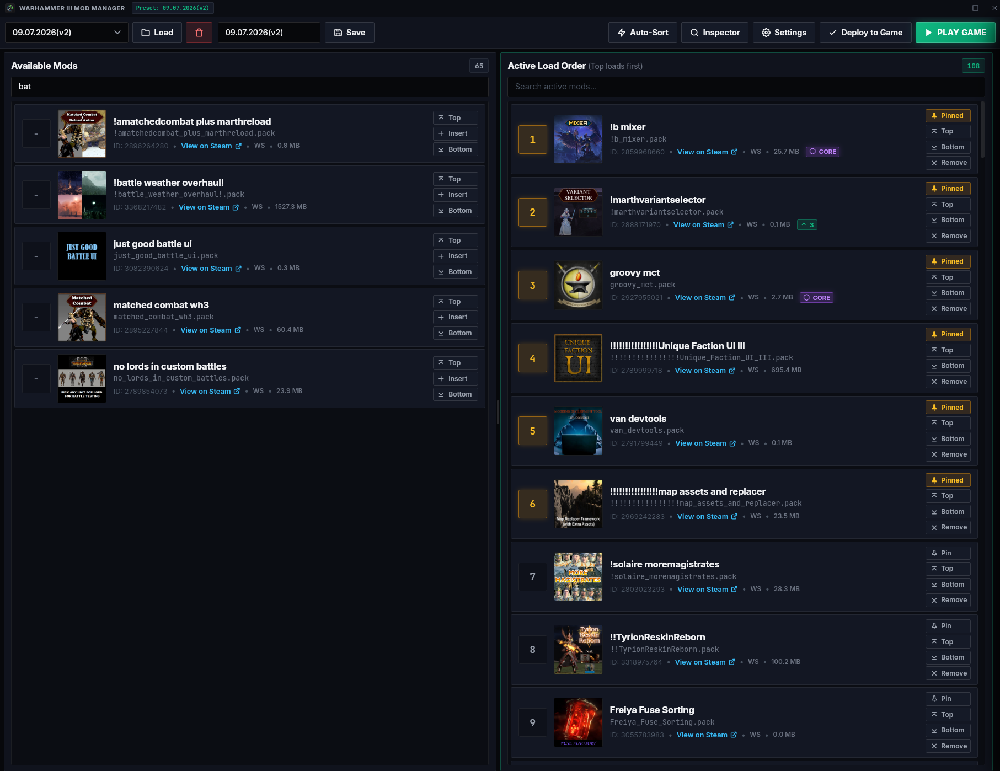
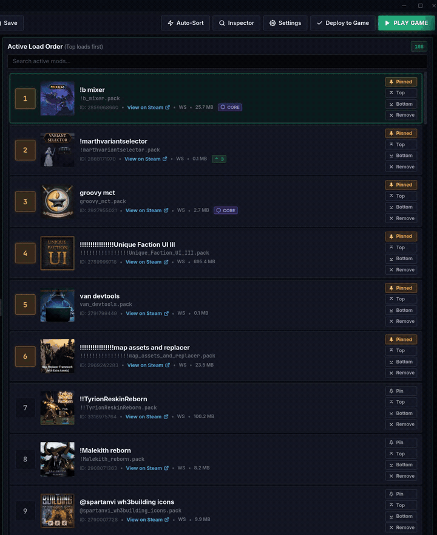

# Total War: WARHAMMER III Mod Manager

[](https://github.com/Leinonen96/CustomModManagerWarhammer3/actions/workflows/ci.yml)
[](https://github.com/Leinonen96/CustomModManagerWarhammer3/actions/workflows/release.yml)
[](https://www.rust-lang.org/)
[](https://v2.tauri.app/)
[](https://www.typescriptlang.org/)

A desktop mod manager and diagnostic tool for **Total War: WARHAMMER III**, built with **Rust**, **Tauri v2**, and **TypeScript**.

Supports load orders ranging from single mods to hundreds of active mods, providing binary PFH pack inspection, topological DAG load order sorting, collision analysis, and native Linux/SteamOS and Windows support.

Most existing Total War mod managers are Windows-centric applications requiring translation layers (such as Wine or Proton) to run on Linux. This project was developed with a native Rust and Tauri v2 architecture to provide first-class Linux and Steam Deck execution alongside Windows without runtime emulation overhead.



---

## Installation

Pre-built binaries and installers are available on the [Releases](https://github.com/Leinonen96/CustomModManagerWarhammer3/releases/latest) page.

| Platform | Download Asset | Installation / Usage |
| :--- | :--- | :--- |
| **Linux (SteamOS / Any Distro)** | `WH3.Mod.Manager_*_amd64.AppImage` | `chmod +x WH3.Mod.Manager_*.AppImage`<br>`./WH3.Mod.Manager_*.AppImage` |
| **Linux (Fedora / RHEL / openSUSE)** | `WH3.Mod.Manager_*_x86_64.rpm` | `sudo dnf install ./WH3.Mod.Manager_*.rpm` |
| **Linux (Debian / Ubuntu)** | `WH3.Mod.Manager_*_amd64.deb` | `sudo dpkg -i WH3.Mod.Manager_*.deb` |
| **Windows 10 / 11** | `WH3.Mod.Manager_*_x64-setup.exe` | Run the installer executable |

---

## Technical Overview

### Binary PFH Pack Parser & Collision Engine
- **In-Memory Binary Parser**: Reads Total War PFH5, PFH4, PFH3, and PFH2 file headers, index tables, and compression bitmasks using buffered binary streams with in-memory `mtime` cache invalidation.
- **Collision Matrix Analysis**: Classifies cross-pack asset collisions into risk tiers:
  - `FatalStartpos`: Detects conflicting `startpos.esf` instances across active campaign overhauls.
  - `ScriptOverride` / `UIOverride`: Identifies winning and overridden `.lua` scripts and `.twui.xml` layouts based on `user.script.txt` execution hierarchy.
  - `DBCollision` & `HarmlessMerge`: Differentiates conflicting database table filenames from additive schema extensions.
  - `MoviePack`: Identifies packs that load directly from game data via engine mechanics rather than `user.script.txt`.



### Topological DAG Dependency Engine
- **Kahn's Algorithm Sorting**: Implements directed acyclic graph (DAG) topological sorting with case-insensitive ASCII priority queues.
- **Mod Pinning Anchors**: Allows users to fix specific foundational mods (e.g., Mixer, Community Bugfix Mod) to exact slots while unpinned mods sort around them.
- **Persistent User Override Rules**: Permanent relative ordering rules (`Mod A loads above/below Mod B`) saved from the conflict inspector and prioritized during automatic sorting.
- **Triple-Check Submod Heuristics**: Evaluates file scale ($\le 25$), parent scale ($\ge 30$), scale disparity ($\ge 3\times$), and file overlap ($\ge 50\%$ or $\ge 4$ files) to automatically order micro-patches and character replacers above parent overhauls.

---

## System Architecture

```
┌─────────────────────────────────────────────────────────────────────────────┐
│                          TAURI v2 APPLICATION                              │
├─────────────────────────────────────────────────────────────────────────────┤
│  FRONTEND (TypeScript / Vanilla CSS)                                        │
│  • ModList: DOM node reconciliation with drag-and-drop (SortableJS)          │
│  • InspectorDrawer: Packfile breakdown & visual collision diff viewer       │
│  • SettingsModal: Installation path detection & user rule management        │
│  • HeaderControls: Presets, auto-sorting, and load order deployment         │
├─────────────────────────────────────────────────────────────────────────────┤
│  IPC BRIDGE (@tauri-apps/api/core)                                          │
├─────────────────────────────────────────────────────────────────────────────┤
│  BACKEND (Rust)                                                             │
│  • pack_parser: Binary PFH pack indexer & collision detector                │
│  • dependency_engine: Topological DAG solver & rule injector                │
│  • game_integrator: user.script.txt generation & symlink manager            │
│  • config_store: Settings persistence & user override rule storage          │
│  • workshop_scanner: Steam Workshop directory scanner & metadata extraction │
│  • preset_repository: Preset storage and retrieval                          │
└─────────────────────────────────────────────────────────────────────────────┘
```

For detailed specifications, see:
- [Load Order Engine & Decision Logic](docs/LOAD_ORDER_ENGINE.md)
- [System Architecture](docs/system-architecture.md)
- [Design System](docs/DESIGN_SYSTEM.md)
- [Product Vision & Principles](docs/vision.md)

---

## Keybindings

| Keybinding | Action |
| :--- | :--- |
| <kbd>Ctrl</kbd> + <kbd>+</kbd> / <kbd>=</kbd> | Zoom workspace in (+5%) |
| <kbd>Ctrl</kbd> + <kbd>-</kbd> | Zoom workspace out (-5%) |
| <kbd>Ctrl</kbd> + <kbd>0</kbd> | Reset workspace zoom (100%) |
| <kbd>Ctrl</kbd> + Mouse Wheel | Adjust workspace zoom (±4%) |
| <kbd>Esc</kbd> | Close inspector drawer, context menu, or active modal |
| Click `#` order badge | Inline numeric position editing |

---

## Building from Source

### Prerequisites
- **Linux** (Debian, Ubuntu, Fedora, Arch Linux, SteamOS) or **Windows 10/11**
- Total War: WARHAMMER III installed via Steam
- [Rust toolchain](https://rustup.rs/) (1.75+)
- [Node.js](https://nodejs.org/) (20.x+)

### Linux Build Dependencies

#### Debian / Ubuntu
```bash
sudo apt update && sudo apt install -y \
  libwebkit2gtk-4.1-dev build-essential curl wget file \
  libssl-dev libgtk-3-dev libayatana-appindicator3-dev librsvg2-dev
```

#### Fedora
```bash
sudo dnf install -y \
  webkit2gtk4.1-devel openssl-devel gtk3-devel \
  libappindicator-gtk3-devel librsvg2-devel
```

#### Arch Linux / Steam Deck (Desktop Mode)
```bash
sudo pacman -S --needed \
  webkit2gtk-4.1 base-devel openssl gtk3 libappindicator-gtk3 librsvg
```

### Development & Testing
```bash
# Install dependencies
npm install

# Run in development mode
npm run tauri:dev

# Run TypeScript typecheck
npm run typecheck

# Run Rust unit tests
cargo test --manifest-path src-tauri/Cargo.toml

# Build release bundle
npm run tauri:build
```

---

## License

This project is currently under private development. All rights reserved. Redistribution, modification, or commercial use without express permission is prohibited.