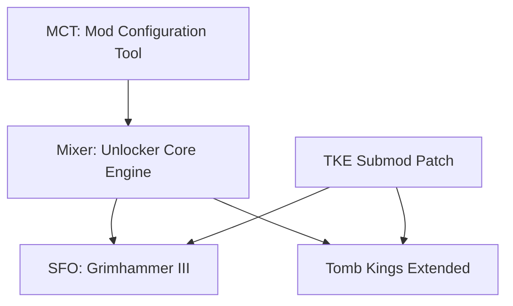
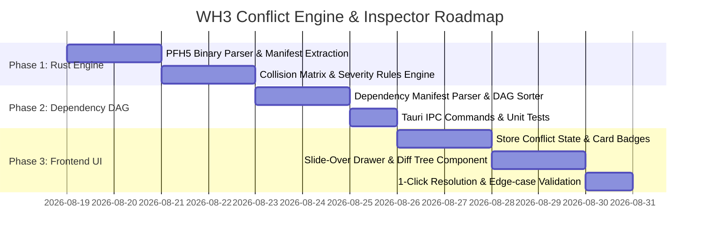

# TECHNICAL ARCHITECTURE PLAN: WH3 CONFLICT ENGINE, DEPENDENCY CHECKER & SLIDE-OVER INSPECTOR

## Executive Summary
This document provides the complete technical architecture and implementation specification for adding a **High-Speed PFH Pack Conflict Engine**, **Dependency DAG Topological Sorter**, and a **Collapsible Right Slide-Over Inspector Drawer** to the Total War: WARHAMMER III Mod Manager (Tauri v2 + Rust + TypeScript).

---

## 1. Codebase Audit & Discovery Report

### 1.1 Current Rust Backend (`src-tauri/`)
- **Pack Discovery**: `WorkshopScanner::scan_workshop` scans Steam Workshop directory `.../workshop/content/1142710/<id>/*.pack`. Reads `publish_data.vdf` for titles and extracts preview thumbnails.
- **Pack Parsing**: **No internal `.pack` (PFH binary) parser exists yet.** The manager currently treats `.pack` files as opaque filesystem objects.
- **State Persistence**:
  - `config.json`: Workshop path, game data path, script path, `last_preset`, and `ui_scale`.
  - `presets/*.json`: Preset definitions containing lists of active mods.
  - Game Execution: `GameIntegrator::apply_load_order` creates symlinks in `Total War WARHAMMER III/data/` and writes `mod "xyz.pack";` to Proton/Wine `user.script.txt`.
- **Performance Characteristics**: Initial scan uses lightweight path streaming (`convertFileSrc`) with near-zero IPC overhead (<45KB payload for 200+ mods).

### 1.2 Current Frontend (`frontend/src/`)
- **State Architecture**: Reactive Event Store (`AppStore` in `frontend/src/state/store.ts`) with typed subscriber channels (`MODS_CHANGED`, `ACTIVE_MODS_CHANGED`, `CONFIG_CHANGED`, `SELECTED_PRESET_CHANGED`, `SEARCH_CHANGED`).
- **Lists & Drag-and-Drop**: `ModList.ts` manages dual-panel `#inactive-mods` and `#active-mods` using `SortableJS`.
- **Styling**: Centralized Pro Studio Design System in `frontend/src/styles/` with semantic design tokens (`tokens.css`), 72px high-fidelity thumbnails (`mod-card.css`), custom DOM select dropdown (`CustomSelect.ts`), and GPU layout containment (`contain: layout style paint; content-visibility: auto;`).

---

## 2. Section 1: Rust Backend Architecture & PFH Engine

### 2.1 High-Speed PFH Binary Pack Parser (`src-tauri/src/services/pack_parser.rs`)

The Total War Warhammer III packfile format uses the **PFH5 / PFH4 (Pack File Header)** binary structure. We implement a non-decompressed zero-copy header and index scanner that extracts internal virtual paths in $< 1\text{ ms}$ per pack without loading file contents into RAM.

```
+-------------------------------------------------------------+
| PFH Header (24-32 bytes)                                    |
| - Magic: 'PFH5' (0x35484650) / 'PFH4' (0x34484650)          |
| - Pack Type (Bitmask): 0=Movie, 1=Boot, 2=Release, 3=Mod     |
| - Dependency Count (u32)                                    |
| - Index Size in bytes (u32)                                 |
| - File Entry Count N (u32)                                  |
+-------------------------------------------------------------+
| Dependency List Table (Zero-terminated ASCII strings)       |
+-------------------------------------------------------------+
| Packed File Index Table (N Entries)                         |
| - File Size (u32)                                           |
| - Compressed Size (u32, if compressed)                      |
| - Flags (u8/u16)                                            |
| - File Path: Null-terminated UTF-8/ASCII string             |
|   (e.g., "db/units_custom_tables/data__")                   |
|   (e.g., "script/campaign/mod/mechanic.lua")                |
+-------------------------------------------------------------+
```

#### Core Data Structures (`src-tauri/src/domain/conflict_models.rs`)
```rust
use serde::{Deserialize, Serialize};
use std::collections::HashMap;

#[derive(Debug, Clone, Copy, PartialEq, Eq, Serialize, Deserialize)]
pub enum PackType {
    Movie,    // Auto-loaded by game engine regardless of user.script.txt
    Mod,      // Standard user-loaded mod
    Release,  // CA Base Pack
    Unknown(u32),
}

#[derive(Debug, Clone, Copy, PartialEq, Eq, Serialize, Deserialize)]
pub enum ConflictSeverity {
    FatalStartpos,  // Hard campaign crash / incompatible startpos.esf
    ScriptOverride, // Overwriting Lua scripts (Top in load order wins)
    UIOverride,     // Overwriting TWUI XML layouts
    DBCollision,    // Identical table file collision
    HarmlessMerge,  // Unique table name in same folder
}

#[derive(Debug, Clone, Serialize, Deserialize)]
pub struct PackedFileManifest {
    pub pack_name: String,
    pub pack_type: PackType,
    pub dependencies: Vec<String>,
    pub files: Vec<String>, // e.g. "db/character_skills_tables/data__"
}

#[derive(Debug, Clone, Serialize, Deserialize)]
pub struct FileConflictDetail {
    pub internal_path: String,
    pub severity: ConflictSeverity,
    pub winner_mod: String,       // Higher in load order (or Movie pack)
    pub winner_index: usize,
    pub loser_mod: String,        // Lower in load order
    pub loser_index: usize,
    pub is_identical_db_table: bool,
}

#[derive(Debug, Clone, Serialize, Deserialize)]
pub struct ModConflictSummary {
    pub mod_name: String,
    pub total_conflicts: usize,
    pub fatal_startpos_count: usize,
    pub script_overrides_won: usize,
    pub script_overrides_lost: usize,
    pub ui_overrides_won: usize,
    pub ui_overrides_lost: usize,
    pub db_collisions: usize,
    pub conflicting_mod_names: Vec<String>,
    pub is_movie_pack: bool,
}

#[derive(Debug, Clone, Serialize, Deserialize)]
pub struct ConflictAnalysisResult {
    pub total_conflicts: usize,
    pub fatal_conflicts: usize,
    pub summaries: HashMap<String, ModConflictSummary>,
    pub detailed_conflicts: Vec<FileConflictDetail>,
}
```

---

### 2.2 Conflict & Override Matrix Rules

1. **Fatal / Startpos Collision**:
   - Matches: `campaigns/**/startpos.esf`
   - Severity: `ConflictSeverity::FatalStartpos`.
   - Behavior: If 2 active mods both contain `startpos.esf`, mark both with `❌ Fatal Conflict`.
2. **Script & UI Overrides**:
   - Matches: `script/**/*.lua`, `ui/**/*.twui.xml`, `ui/**/*.skin`.
   - Severity: `ConflictSeverity::ScriptOverride` / `ConflictSeverity::UIOverride`.
   - Evaluation: Based on active load order index (Position 1 wins over Position 2+).
   - Badges: Winning mod gets `▲ (Overrides lower mod)`, losing mod gets `▼ (Overridden by higher mod)`.
3. **Smart DB Table Merging**:
   - Total War WARHAMMER III merges database tables by folder name (`db/<table_name>_tables/`).
   - If Mod A contains `db/units_tables/mod_a_data` and Mod B contains `db/units_tables/mod_b_data`, **No Conflict (Harmless Merge)**.
   - If Mod A contains `db/units_tables/data__` and Mod B also contains `db/units_tables/data__`, **DB Collision Warning** (Mod A completely overwrites Mod B's table).
4. **Movie Pack Interception**:
   - If `pack_type == PackType::Movie`, mark with `🎬 Movie Pack Alert`. Movie packs are loaded first by CA engine directly from `data/` and bypass `user.script.txt` ordering.

---

### 2.3 Dependency Graph & Topological Auto-Sorter (`src-tauri/src/services/dependency_engine.rs`)



1. **Dependency Extraction**:
   - Extracted from PFH header dependency list + Workshop `publish_data.vdf`.
2. **Topological Sorter (Kahn's Algorithm)**:
   - Nodes = Active Mods.
   - Directed Edges = Prerequisite $\rightarrow$ Dependent Mod.
   - Detects cycles ($A \rightarrow B \rightarrow A$) and preserves existing user order for independent nodes.
   - Resolves missing dependencies (`missing_dependencies: Vec<String>`).

---

### 2.4 New Tauri IPC Commands (`src-tauri/src/commands/conflict_cmds.rs`)

```rust
#[tauri::command]
pub fn analyze_load_order_conflicts(
    active_mods: Vec<Mod>,
) -> Result<ConflictAnalysisResult, String>;

#[tauri::command]
pub fn get_pack_file_tree(
    pack_path: String,
) -> Result<PackedFileManifest, String>;

#[tauri::command]
pub fn auto_sort_dependencies(
    active_mods: Vec<Mod>,
) -> Result<Vec<Mod>, String>;
```

---

## 3. Section 2: Frontend State & UI Architecture

### 3.1 State Schema Extensions (`frontend/src/state/store.ts`)

```typescript
export interface ConflictState {
    analysisResult: ConflictAnalysisResult | null;
    inspectedMod: Mod | null;
    isDrawerOpen: boolean;
    activeTab: 'overview' | 'conflicts' | 'dependencies' | 'steam';
    filterMode: 'all' | 'conflicts_only' | 'fatal_only';
}
```

New Store Events:
- `CONFLICTS_ANALYZED`
- `INSPECTOR_MOD_CHANGED`
- `DRAWER_TOGGLED`

---

### 3.2 Main Layout Grid & Collapsible Drawer Blueprint

```
+-------------------------------------------------------------------------------------------------------+
|  [TITLEBAR] WH3 Mod Manager (Frameless)                                                    [_] [□] [✕]|
+-------------------------------------------------------------------------------------------------------+
|  [TOOLBAR] [Preset ▾] [Load] [Save] [Delete]           | [Search...] | [Auto-Sort ⚡] [⚙ Settings] [APPLY] |
+---------------------------------------------------------------------------------------+---------------+
|  AVAILABLE MODS (35%)       |  ACTIVE LOAD ORDER (40%)                                | INSPECTOR     |
|                             |                                                         | DRAWER (25%)  |
|  [ Search Available... ]    |  [ Search Active... ]                                   |               |
|                             |                                                         | [Overview]    |
|  +-----------------------+  |  +---------------------------------------------------+  | [Conflicts]   |
|  | [72px] SFO Grimhammer |  |  | #1 [72px] Mixer: Unlocker Core           ▲ [OK]   |  | [Dependencies]|
|  |        1.2 GB         |  |  +---------------------------------------------------+  | [Actions]     |
|  +-----------------------+  |  | #2 [72px] Tomb Kings Extended        ▲ 3  ▼ 1 [OK]   |  |               |
|  | [72px] Radious Part 1 |  |  +---------------------------------------------------+  | Exact Diff:   |
|  |        800 MB         |  |  | #3 [72px] Submod Patch             ❌ FATAL STARTPOS|  | 3 overrides   |
|  +-----------------------+  |  +---------------------------------------------------+  | 1 collision   |
|                             |                                                         | [Move Above ▲]|
+---------------------------------------------------------------------------------------+---------------+
```

#### Responsive Transition:
- Default state: 50% Available / 50% Active.
- When a mod card is clicked or inspected: Active panel smoothly adjusts to 38% / 37% / 25% (Inspector Drawer slides in from the right with CSS `transition: width 0.15s cubic-bezier(0.16, 1, 0.3, 1)`).

---

### 3.3 Card Badges & Interactive Indicators

Each mod card in [frontend/src/components/ModCard.ts](file:///mnt/GG/Mods/CustomModManagerWarhammer3/frontend/src/components/ModCard.ts) receives clean studio conflict indicators:
- **Clean Mod**: Subtle gray `0 conflicts` or hidden badge.
- **Winning Override (`▲ 2`)**: Green badge showing 2 lower mods overridden.
- **Losing Override (`▼ 1`)**: Amber badge showing 1 file overridden by higher mod.
- **Fatal Startpos Collision (`❌ FATAL`)**: Red badge with glowing border.
- **Inspect Action**: Clicking the card or badge opens the Inspector Drawer focused on that mod.

---

### 3.4 Inspector Drawer Tabs & Quick Action Handlers

1. **Overview Tab**:
   - File counts by type (DB, Lua Scripts, TWUI XMLs, Audio, Startpos).
   - Movie pack status and pack header type.
2. **Conflicts Diff Tab**:
   - Hierarchical tree:
     - 📁 `campaigns/main_warhammer/startpos.esf` (❌ Collides with *Mod B*)
     - 📁 `script/campaign/mod/mechanics.lua` (▲ Overrides *Mod C*)
     - 📁 `db/units_custom_tables/data__` (⚠️ Duplicate Table File with *Mod D*)
3. **Quick Actions Tab**:
   - `[ ⤒ Move Above Conflict Winner ]`: Reorders the mod immediately above the overriding mod.
   - `[ ⤓ Move Below Overriding Mod ]`: Reorders the mod below.
   - `[ ⚡ Auto-Resolve Active Load Order ]`: Runs DAG topological sort on all active mods.

---

## 4. Section 3: Implementation Roadmap



### Phase 1: Rust PFH5 Binary Parser & Collision Engine
- Create `src-tauri/src/services/pack_parser.rs`.
- Read PFH5/PFH4 binary header magic and file index.
- Build collision detector for startpos, Lua scripts, TWUI XMLs, duplicate DB tables, and movie packs.
- Add Rust unit tests with mock pack binary headers.

### Phase 2: Dependency DAG Sorter
- Create `src-tauri/src/services/dependency_engine.rs`.
- Parse dependencies from pack header and workshop metadata.
- Implement topological sort with cycle protection.

### Phase 3: Tauri IPC & Backend Integration
- Register `analyze_load_order_conflicts`, `get_pack_file_tree`, and `auto_sort_dependencies` in `src-tauri/src/lib.rs`.
- Add IPC serialization tests.

### Phase 4: Frontend State & Mod Card Badges
- Extend `store.ts` with `ConflictAnalysisResult`.
- Update `ModCard.ts` with `▲`, `▼`, `❌`, `🎬` badge indicators.
- Update `ModList.ts` to trigger conflict analysis on load order reorder.

### Phase 5: Collapsible Slide-Over Inspector Drawer
- Create `frontend/src/components/InspectorDrawer.ts`.
- Create `frontend/src/styles/drawer.css`.
- Implement Overview, Conflicts Diff tree, Dependencies, and Quick Action buttons (`Move Above`, `Move Below`, `Auto-Sort`).

### Phase 6: Edge Case Verification
- Verify corrupted/empty `.pack` handling.
- Verify 200+ mods conflict scan finishes under $50\text{ ms}$.
- Verify smooth 144 FPS UI animations during drawer collapse/expand.
