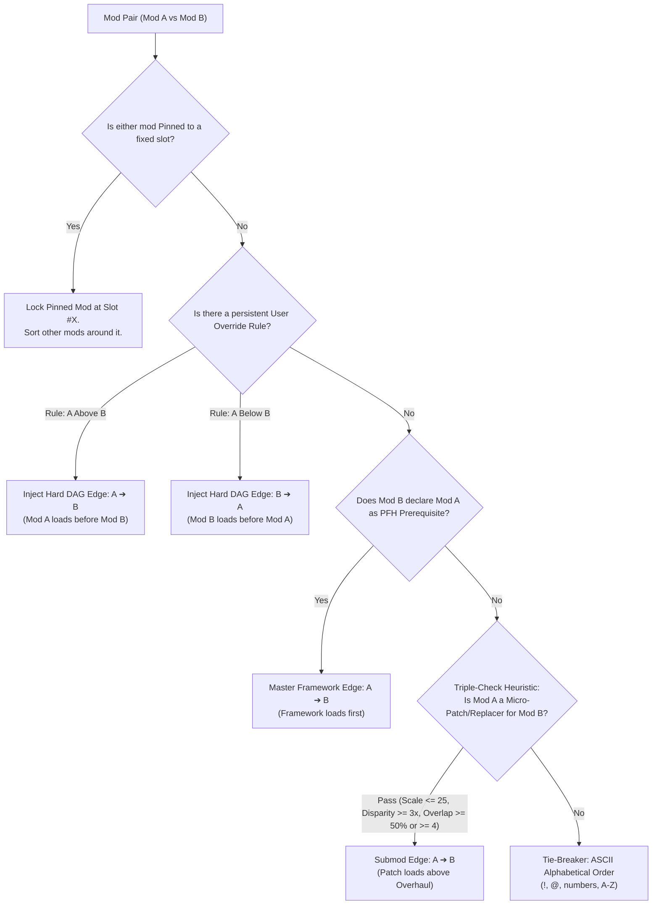

# Total War: WARHAMMER III - Load Order Engine & Decision Logic

## 1. Executive Summary & Engine Load Model

The Total War: WARHAMMER III game engine resolves mod packfiles via two distinct mechanisms: the **`user.script.txt` Load Order** and the **Physical File System (`/data/`)**.

```
Physical Disk: /steamapps/workshop/content/1142710/ & /data/
                        │
                        ▼
          Fast Binary Pack Parser (Rust)
                        │
                        ▼
┌─────────────────────────────────────────────────────────────┐
│             Topological DAG Dependency Engine               │
│                                                             │
│  [Tier 0] Pinned Mod Anchors (Locked Slots #1, #2, etc.)    │
│  [Tier 1] Persistent User Override Rules (A Above/Below B) │
│  [Tier 2] PFH Header Master Framework Prerequisite Edges    │
│  [Tier 3] Triple-Check Micro-Patch & Character Replacers    │
│  [Tier 4] Case-Insensitive ASCII Prefix Priority Queue      │
└─────────────────────────────────────────────────────────────┘
                        │
                        ▼
      Output: user.script.txt ("Deploy to Game")
```

---

## 2. Total War Engine Precedence Rules

### A. The "First-Line Wins" Rule (Textures, Models, Lua Scripts, UI Layouts)
For non-DB assets, Total War uses a **first-line priority system** in `user.script.txt`:
* `rigid_model_v2` / `wsmodel` (3D character meshes, heads, bodies, weapons)
* `.dds` (Textures, diffuse, specular, normal, mask maps)
* `.lua` (Campaign, battle, and frontend scripts)
* `.xml.material` / `.anim` (Animations and shader definitions)
* `.png` / `.tga` (Unit cards, portholes, UI icons)

> [!IMPORTANT]
> If Mod A is written on line 1 (`mod "ModA.pack";`) and Mod B is on line 2 (`mod "ModB.pack";`), and both contain `variantmeshes/hu1d/def/malekith_head.dds`, **Mod A's texture is loaded and Mod B's texture is ignored**.

### B. Additive DB Table Merging
For database tables (`db/`), the engine attempts an additive merge:
* If Mod A adds `db/units_custom__modA/data__` and Mod B adds `db/units_custom__modB/data__`, **both tables merge cleanly without collision**.
* If both mods declare the identical table filename (e.g. `db/main_units_tables/data__`), the first mod in `user.script.txt` takes precedence for colliding key rows.

### C. Packfile Header Types
* **Movie Packs (`0x00000001` bitmask)**: Automatically loaded first directly by the engine executable from `/data/`, bypassing `user.script.txt`.
* **Mod Packs (`0x00000003` bitmask)**: Controlled 100% by the order in `user.script.txt`.

---

## 3. The Topological DAG Sorting Algorithm

The load order engine models all active mods as a **Directed Acyclic Graph (DAG)**:
* **Nodes ($V$)**: Individual packfiles ($P_1, P_2, \dots, P_n$).
* **Directed Edges ($A \rightarrow B$)**: Signifies that $A$ must be loaded **BEFORE** $B$ in `user.script.txt` (giving $A$ priority over $B$).

### Kahn's Algorithm with ASCII Priority Queue
1. Compute in-degree for all unpinned nodes.
2. Initialize a ready queue of all nodes with `in_degree == 0`.
3. Sort ready queue nodes using **case-insensitive ASCII order** (`!`, `@`, `0-9`, `A-Z`).
4. Iteratively pop the highest-priority node, add it to the sorted list, and decrement neighbor in-degrees.
5. If a cycle is detected, fallback to deterministic ASCII ordering for unvisited nodes.
6. Merge sorted unpinned nodes with **Pinned Anchors** into their exact target slots.

---

## 4. Priority & Decision Hierarchy



---

## 5. Decision Rules Breakdown

### Tier 0: Mod Pinning Anchors (`pinned_mods`)
* **Behavior**: Locks specific foundational mods (e.g. `!b_mixer.pack`, `@community_bugfix_mod.pack`, `!mct.pack`) to exact 1-indexed positions (`#1`, `#2`, etc.).
* **Auto-Sort Execution**: Pinned mods never move during Auto-Sort; all remaining mods are sorted and filled into the free slots around them.

### Tier 1: Persistent User Override Rules (`user_rules.json`)
* **Behavior**: When a user resolves a conflict in the Conflict Inspector (by clicking `Prioritize Above` or `Load Below`), a permanent relative rule is stored.
* **Auto-Sort Execution**: User override rules are injected into the DAG with highest graph priority, overriding ASCII conventions and default heuristics.

### Tier 2: Pack Header Explicit Framework Dependencies
* **Behavior**: Master frameworks (`!b_mixer.pack`, `MCT`, `CBFM`) declare or are declared as prerequisites in pack headers.
* **Auto-Sort Execution**: Prerequisite master frameworks always load first before dependent submods (`Framework ➔ Mod`).

### Tier 3: The Triple-Check Micro-Patch & Character Replacer Auto-Resolver
Solves the common Total War modding dilemma where a small submod or character replacer has fewer exclamation marks in its filename than its massive parent overhaul (e.g. `!Malekith_reborn.pack` vs `!!!DelfRebornVariants.pack`).

The engine runs a **Triple-Check Mathematical Evaluator**:
1. **Micro-Patch / Submod Scale**: Mod A has $\le 25$ total indexed files.
2. **Scale Disparity**: Mod B is a major parent overhaul with $\ge 30$ files and $F_B \ge 3 \times F_A$ (e.g., 564 files vs 14 files).
3. **Containment Overlap**: $\ge 50\%$ of Mod A's files collide with Mod B **OR** there are $\ge 4$ colliding files ($C_{AB} \ge 4$).

**Result**: Mod A is automatically elevated **ABOVE** Mod B in the load order so the character replacer's custom textures and meshes win in-game.

### Tier 4: Natural ASCII Alphabetical Ordering (Tie-Breaker)
* When no explicit dependencies or micro-patch containment relationships exist between two independent mods, Kahn's algorithm tie-breaks using case-insensitive ASCII pack filename sorting:
  1. `!` (ASCII 33)
  2. `@` (ASCII 64)
  3. `0-9` (ASCII 48-57)
  4. `A-Z` (ASCII 65-90)

---

## 6. Conflict Severity Classifications

| Severity | File Types | Engine Behavior & Risk |
| :--- | :--- | :--- |
| **`FatalStartpos`** | `startpos.esf` | **Critical**: Multiple active startpos mods will corrupt campaign generation and cause game crashes. |
| **`ScriptOverride`** | `script/**/*.lua` | **High**: The first mod in `user.script.txt` executes its Lua script; conflicting lower-order scripts are ignored. |
| **`UIOverride`** | `ui/**/*.twui.xml` | **Medium**: The first mod's UI layout template wins. |
| **`DBCollision`** | Identical `db/table/data__` | **Medium**: Colliding table rows are overwritten by the higher-priority pack. |
| **`HarmlessMerge`** | Distinct `db/custom_table/` | **Harmless**: Distinct DB table files cleanly merge additively. |
