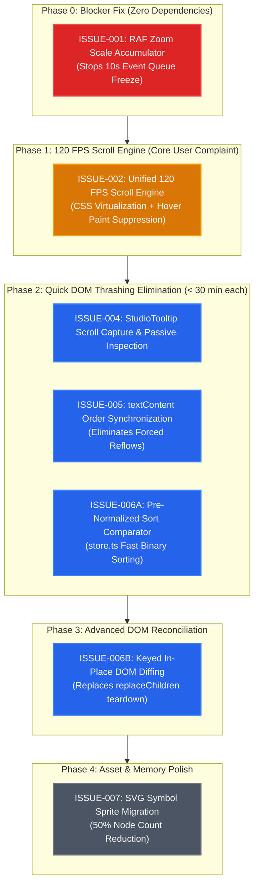

# Engineering Performance & DOM Optimization Backlog

This backlog catalogs discrete performance, architectural, and styling issues identified during the UI, virtualization, and DOM performance audit. Each issue details root causes, impacted components, proposed resolutions, and testable acceptance criteria.

---

## Priority & Phased Execution Tree (DAG)

The priority structure is organized into **5 sequential phases** based on impact-to-effort ratio, risk isolation, and architectural dependencies:

---

## Issue Catalog & Priority Matrix

| Issue ID | Title | Priority | Phase | Severity | Component | Estimated Effort |
| :--- | :--- | :--- | :--- | :--- | :--- | :--- |
| [ISSUE-001](file:///mnt/GG/VSCodeProjects/CustomModManagerWarhammer3/docs/backlog/issues/ISSUE-001-zoom-hotkey-event-loop-saturation.md) | **Zoom Hotkey Event Loop Saturation & 10-Second Freeze** | **P0 - Critical** | **Phase 0** | S1 (Blocker) | `ZoomController` / Scaling | 1–2 hours |
| [ISSUE-002](file:///mnt/GG/VSCodeProjects/CustomModManagerWarhammer3/docs/backlog/issues/ISSUE-002-mod-list-virtualization-and-content-skipping.md) | **Mod List 120 FPS Scroll Engine (CSS Virtualization & Hover Paint Suppression)** | **P1 - High** | **Phase 1** | S2 (Major) | `ModList` / CSS Engine | 2–3 hours |
| [ISSUE-004](file:///mnt/GG/VSCodeProjects/CustomModManagerWarhammer3/docs/backlog/issues/ISSUE-004-studio-tooltip-mid-scroll-dom-mutation.md) | **StudioTooltip Mid-Scroll DOM Mutation & Capture Invalidation** | **P2 - Medium** | **Phase 2** | S3 (Moderate) | `StudioTooltip` | 1 hour |
| [ISSUE-005](file:///mnt/GG/VSCodeProjects/CustomModManagerWarhammer3/docs/backlog/issues/ISSUE-005-layout-thrashing-order-number-updates.md) | **Forced Synchronous Layout Thrashing in Order Synchronization** | **P2 - Medium** | **Phase 2** | S3 (Moderate) | `ModList` DOM Sync | 1 hour |
| [ISSUE-006A](file:///mnt/GG/VSCodeProjects/CustomModManagerWarhammer3/docs/backlog/issues/ISSUE-006A-fast-prenormalized-sort-comparator.md) | **Fast Pre-Normalized Sort Comparator** | **P2 - Medium** | **Phase 2** | S3 (Moderate) | `AppStore` / Sorting Engine | 30 minutes |
| [ISSUE-006B](file:///mnt/GG/VSCodeProjects/CustomModManagerWarhammer3/docs/backlog/issues/ISSUE-006B-keyed-inplace-dom-reconciliation.md) | **Keyed In-Place DOM Reconciliation** | **P2 - Medium** | **Phase 3** | S3 (Moderate) | `ModList` DOM Diffing | 1–2 hours |
| [ISSUE-007](file:///mnt/GG/VSCodeProjects/CustomModManagerWarhammer3/docs/backlog/issues/ISSUE-007-dom-node-density-inline-svg-overhead.md) | **Excessive DOM Node Density & Inline SVG Vector Duplication** | **P3 - Low** | **Phase 4** | S4 (Minor) | `ModCard` / Assets | 2–4 hours |

*Merged / Superseded References*:
- [ISSUE-003](file:///mnt/GG/VSCodeProjects/CustomModManagerWarhammer3/docs/backlog/issues/ISSUE-003-scroll-hover-paint-storms.md) $\rightarrow$ *Merged into [ISSUE-002](file:///mnt/GG/VSCodeProjects/CustomModManagerWarhammer3/docs/backlog/issues/ISSUE-002-mod-list-virtualization-and-content-skipping.md)*.
- [ISSUE-006](file:///mnt/GG/VSCodeProjects/CustomModManagerWarhammer3/docs/backlog/issues/ISSUE-006-reconciliation-dom-teardown-and-comparator-sorting.md) $\rightarrow$ *Split into [ISSUE-006A](file:///mnt/GG/VSCodeProjects/CustomModManagerWarhammer3/docs/backlog/issues/ISSUE-006A-fast-prenormalized-sort-comparator.md) & [ISSUE-006B](file:///mnt/GG/VSCodeProjects/CustomModManagerWarhammer3/docs/backlog/issues/ISSUE-006B-keyed-inplace-dom-reconciliation.md)*.

---

## Detailed Phase Execution Roadmap

### Phase 0: Blocker Fix (Zero Dependencies)
- **Target Issue**: [ISSUE-001: Zoom Hotkey Event Loop Saturation & 10-Second Freeze](file:///mnt/GG/VSCodeProjects/CustomModManagerWarhammer3/docs/backlog/issues/ISSUE-001-zoom-hotkey-event-loop-saturation.md)
- **Files**: [ZoomController.ts](file:///mnt/GG/VSCodeProjects/CustomModManagerWarhammer3/frontend/src/controllers/ZoomController.ts), [tokens.css](file:///mnt/GG/VSCodeProjects/CustomModManagerWarhammer3/frontend/src/styles/tokens.css)
- **Action**: Implement a `requestAnimationFrame` scale accumulator that collapses 30–60 `keydown` events per second into single-frame updates; remove redundant `:root` `--ui-scale` invalidations.
- **Expected Outcome**: Instantaneous zoom response. Spamming hotkeys halts immediately upon key release with zero queued lag.

### Phase 1: 120 FPS Scroll Engine (Core User Complaint)
- **Target Issue**: [ISSUE-002: Mod List 120 FPS Scroll Engine](file:///mnt/GG/VSCodeProjects/CustomModManagerWarhammer3/docs/backlog/issues/ISSUE-002-mod-list-virtualization-and-content-skipping.md)
- **Files**: [mod-card.css](file:///mnt/GG/VSCodeProjects/CustomModManagerWarhammer3/frontend/src/styles/mod-card.css), [components.css](file:///mnt/GG/VSCodeProjects/CustomModManagerWarhammer3/frontend/src/styles/components.css), [ModList.ts](file:///mnt/GG/VSCodeProjects/CustomModManagerWarhammer3/frontend/src/components/ModList.ts)
- **Action**:
  1. Add `content-visibility: auto` and `contain-intrinsic-size: auto 86px` to `.mod-item`.
  2. Add `.mod-list.is-scrolling .mod-item { pointer-events: none !important; }` to suppress hover hit-testing during active scroll.
  3. Clean up transitions on `.mod-item` (remove unused `box-shadow`) and `.order-num` (replace `transition: all`).
- **Expected Outcome**: Fast scrolling 100+ active mods maintains locked 60–120 FPS. Off-screen DOM rendering drops by 85%.

### Phase 2: Quick DOM Thrashing Elimination (High ROI, Low Risk)
- **Target Issues**:
  - [ISSUE-004: StudioTooltip Mid-Scroll DOM Mutation & Capture Invalidation](file:///mnt/GG/VSCodeProjects/CustomModManagerWarhammer3/docs/backlog/issues/ISSUE-004-studio-tooltip-mid-scroll-dom-mutation.md)
  - [ISSUE-005: Forced Synchronous Layout Thrashing in Order Synchronization](file:///mnt/GG/VSCodeProjects/CustomModManagerWarhammer3/docs/backlog/issues/ISSUE-005-layout-thrashing-order-number-updates.md)
  - [ISSUE-006A: Fast Pre-Normalized Sort Comparator](file:///mnt/GG/VSCodeProjects/CustomModManagerWarhammer3/docs/backlog/issues/ISSUE-006A-fast-prenormalized-sort-comparator.md)
- **Files**: [StudioTooltip.ts](file:///mnt/GG/VSCodeProjects/CustomModManagerWarhammer3/frontend/src/components/StudioTooltip.ts), [ModList.ts](file:///mnt/GG/VSCodeProjects/CustomModManagerWarhammer3/frontend/src/components/ModList.ts), [store.ts](file:///mnt/GG/VSCodeProjects/CustomModManagerWarhammer3/frontend/src/state/store.ts)
- **Action**:
  1. Remove `setAttribute` and `removeAttribute` calls from `StudioTooltip.handleMouseOver`; add capture-phase scroll listener (`document.addEventListener('scroll', ..., { capture: true })`).
  2. Replace `innerText` with `textContent` in `updateOrderNumbers()`.
  3. Pre-normalize lowercase titles in `store.ts` and use native `<` / `>` comparisons instead of ICU `localeCompare()`.
- **Expected Outcome**: Eliminates all forced synchronous layout reflows during drag-and-drop and order editing; sort operations execute in < 1 ms with zero string heap allocations.

### Phase 3: Advanced DOM Reconciliation
- **Target Issue**: [ISSUE-006B: Keyed In-Place DOM Reconciliation](file:///mnt/GG/VSCodeProjects/CustomModManagerWarhammer3/docs/backlog/issues/ISSUE-006B-keyed-inplace-dom-reconciliation.md)
- **Files**: [ModList.ts](file:///mnt/GG/VSCodeProjects/CustomModManagerWarhammer3/frontend/src/components/ModList.ts)
- **Action**: Refactor `render()` to detect unchanged item sequences and update card states in-place, eliminating `replaceChildren()` container teardowns on pin toggles and rule updates.
- **Expected Outcome**: Pin toggles and filter switching preserve browser geometry caches with zero visual flash.

### Phase 4: Asset & Memory Polish
- **Target Issue**: [ISSUE-007: Excessive DOM Node Density & Inline SVG Vector Duplication](file:///mnt/GG/VSCodeProjects/CustomModManagerWarhammer3/docs/backlog/issues/ISSUE-007-dom-node-density-inline-svg-overhead.md)
- **Files**: [ModCard.ts](file:///mnt/GG/VSCodeProjects/CustomModManagerWarhammer3/frontend/src/components/ModCard.ts), [components.css](file:///mnt/GG/VSCodeProjects/CustomModManagerWarhammer3/frontend/src/styles/components.css)
- **Action**: Consolidate 2,500+ inline SVGs into a single SVG symbol sprite sheet (`<svg><use href="#icon-..."/></svg>`); tune backdrop blur filters.
- **Expected Outcome**: Total DOM element count cut by 40–50%; lower webview process memory footprint.
